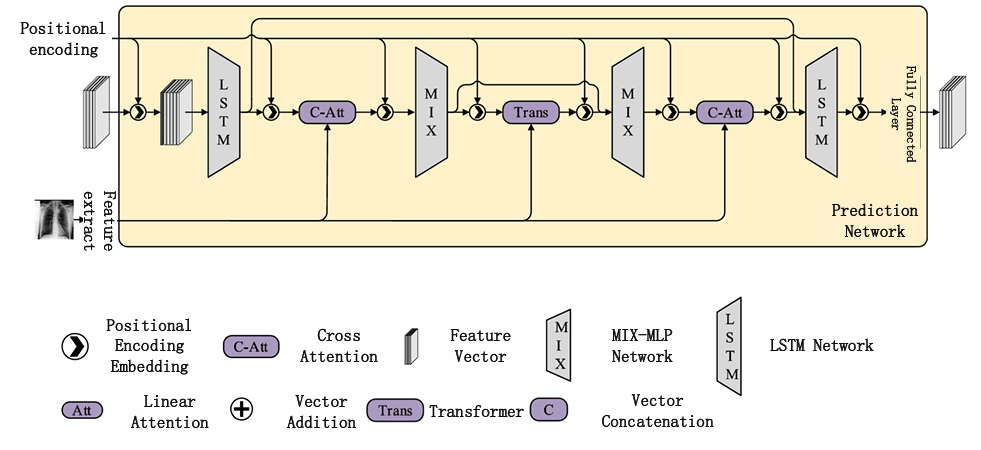

## Optimizing Medical Image Report Generation through a Discrete Diffusion Framework

A novel method for automatically generating diagnostic reports through medical imaging using a diffusion model.

</img>


## Install

```bash
 conda install torch torchvision
 pip install denoising_diffusion_pytorch transformers nltk
```

## Usage
You need to first organize the dataset as follows.
```bash
/path/to/your/dataset_root_dir
|-- images
|   |-- 0
|   |-- 1
|   `-- ...
`-- data.json
```
train
```bash
python train.py \
    --dataset iuxray \
    --root_dir /path/to/your/dataset_root_dir \
    --tsv_path /path/to/your/tsv_path \
    --image_path /path/to/your/image_path \
    --output /path/to/your/output \
    --resume False \
    --resume_checkpoints /path/to/your/checkpoints \
    ;
```

interference
```bash
python inference.py \
    --dataset iuxray \
    --root_dir /path/to/your/dataset_root_dir \
    --tsv_path /path/to/your/tsv_path \
    --image_path /path/to/your/image_path \
    --checkpoints /path/to/your/checkpoints \
    ;
```


## Citations

```bibtex
@inproceedings{NEURIPS2020_4c5bcfec,
    title={Optimizing Medical Image Report Generation through a Discrete Diffusion Framework}, 
    author={ Shuifa Sun, Zhanglin Su, Junsen Meizhou, Yang Feng,Qin Hu, Keyong Hu, Zhen Yang},
    booktitle = {The Journal of Supercomputing},
    year={2025}
}
```

